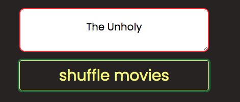
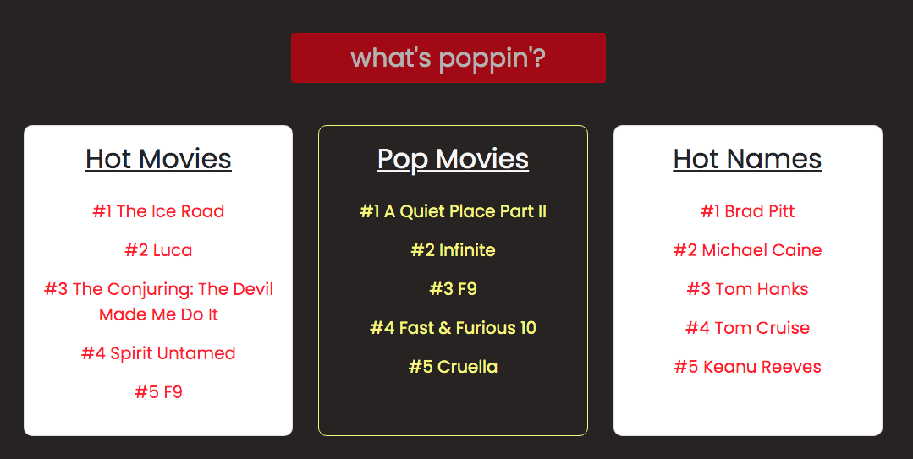
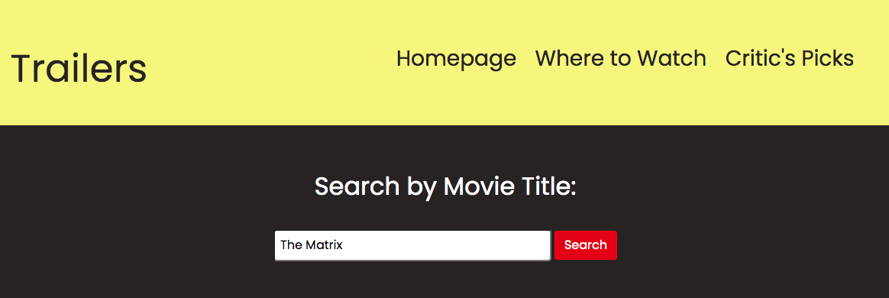
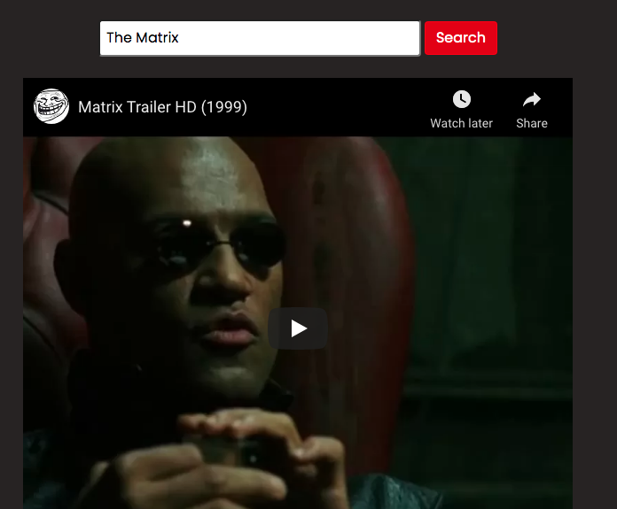

# movie-pop

Project 1: Movie Pop
 

Group 2 Members: Lillian, Zach, Josh, Ted

 
Description:
 
The objective of the application, Movie Pop, is to function as a one-stop shop for all things movies. Whether that's getting a popular movie recommendation, seeing what's currently trending, reading top reviewed movies, watching trailers, or finding where to watch a particular movie. Movie Pop accomplishes all of the previously mentioned items without the hassle. It is great for the casual movie browser or an avid movie fanatic. Movie Pop is also suited well for group settings like parties. It is designed to function as both a PC and mobile application.  

 
Technologies Used:
 
Movie Pop was developed using HTML, Google Fonts, CSS, Bootstrap, Javascript, and three server-side APIs. The three different server-side APIs were: The Movie Database (TMDb) for the homepage and trailers files, NYT Movie Reviews for the top-rated reviews files, and Watchmode for the where to watch files. For best results on PC, please render using Chrome.  

 
App's Features:
 
Homepage: The homepage's main function is to direct the user to read reviews she/he is interested, check out movie trailers, or find where to watch a movie. It provides a suggested movie that is randomly generated from the top 20 popular movies on the TMDb database. For each click event the user is given a new movie recommendation. The "what's poppin'?" section displays trending movie information.  
Reviews: Once in the reviews page the user can click different buttons that will display segments of top critically acclaimed movies. The user can read and see relevant images of the displayed movie titles.   
Trailers: In this section, the user can search for any movie they'd like to and watch the relevant YouTube trailer for it. They can use their result from the movie shuffler or just type in something they're interested in. Note: the code for this application does function as expected, but YouTube sends back console log messages indicating their embedded URL was not used. This doesn't affect the application's performance.   
Where to Watch: If the user is curious about a movie they'd like to see, she/he can use this page to see if Netflix, Disney+, etc. are streaming the particular movie. After each search event, the typed in text is saved to local storage. This method allows the user to view their past searches. If the user wants to start fresh she/he can use the clear button to remove these previous searches from this page and local storage.  

 
Deployed Application URL: 
Check out the deployed application here >>  https://tedheikkila.github.io/movie-pop/ 

 
Screenshots:
 
Homepage: movie shuffler feature

 
Homepage: 3 main pages of Movie Pop

 
Homepage: what's popping?

 
Homepage: output for movie shuffler

 
Homepage: output for what's poppin'?

 
Critic's Picks

 
Critic's Picks: Picks 1-5

 
Trailers

 
Trailers: searched movie output

 
Where to Watch

 
Where to Watch: searched movie output

 
Where to Watch: previously searched movies
 

 

